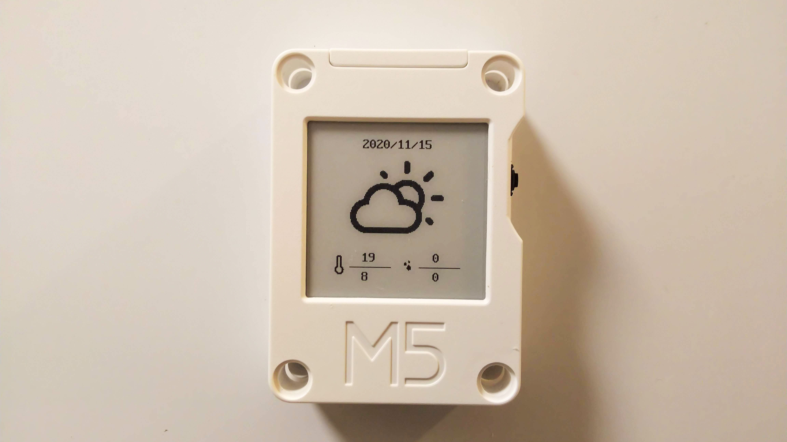

# CoreInk Weather

M5Stack CoreInk で日本の天気予報を表示する Arduino スケッチ。



## 機能

- 気象庁データ（drk7.jp 経由）から東京地方の天気予報を取得
- e-ink ディスプレイに天気アイコン・気温・降水確率を表示
- ボタン操作で今日 / 明日 / 明後日の天気を切り替え
  - UP: 今日
  - MID: 明日
  - DOWN: 明後日
  - PWR: シャットダウン

## 必要なもの

### ハードウェア

- M5Stack CoreInk

### ソフトウェア

- Arduino IDE
- **ESP32 Arduino Core 2.0.17**（ボード: `ESP32-PICO-D4`）
- M5Core-Ink ライブラリ **v0.0.7**
- ArduinoJson ライブラリ

## セットアップ

### 1. ライブラリのインストール

Arduino IDE のライブラリマネージャから以下をインストール:

- **M5Core-Ink** バージョン **0.0.7**
- **ArduinoJson**

### 2. M5Core-Ink ライブラリの修正（必須）

v0.0.7 には GPIO1（UART TX）を誤って操作するバグがあり、起動時にクラッシュリブートします。

`M5CoreInk.cpp`（ライブラリフォルダ内）の `pinMode(1, OUTPUT)` と `digitalWrite(1, LOW)` を全てコメントアウトしてください:

```cpp
// M5CoreInk.cpp の begin() 内
// pinMode(1, OUTPUT);  // GPIO1はUART TXなのでコメントアウト

// shutdown() 関数内（全オーバーロード）
// pinMode(1, OUTPUT);
// digitalWrite(1, LOW);
```

ライブラリの場所:
- Windows: `C:\Users\<user>\Documents\Arduino\libraries\M5Core-Ink\src\M5CoreInk.cpp`
- macOS: `~/Documents/Arduino/libraries/M5Core-Ink/src/M5CoreInk.cpp`
- Linux: `~/Arduino/libraries/M5Core-Ink/src/M5CoreInk.cpp`

### 3. ボード設定

Arduino IDE で以下を設定:

- **ツール > ボード**: `ESP32-PICO-D4`

> `m5stack_coreink` は ESP32 Core 2.0.17 には存在しません。

### 4. WiFi 設定

`CoreInk-Weather.ino` の以下の行を自分の WiFi 環境に合わせて変更:

```cpp
const char* WIFI_SSID = "YOUR_WIFI_SSID";
const char* WIFI_PASS = "YOUR_WIFI_PASSWORD";
```

### 5. 地域の変更（オプション）

デフォルトは東京地方です。他の地域に変更するには:

```cpp
const char* endpoint = "https://www.drk7.jp/weather/json/13.js";  // 都道府県コード
const char* region = "東京地方";  // 地域名
```

都道府県コードは [drk7.jp](http://www.drk7.jp/weather/) を参照してください。

## 注意事項

- M5Core-Ink v1.0.0 は ESP32 Core 3.x 向けのため、Core 2.0.17 では動作しません
- `Ink_eSPI` クラスに `drawString` はありません。文字描画は `Ink_Sprite` 経由で行います
- HTTPS 接続時は `WiFiClientSecure` + `setInsecure()` を使用しています（証明書検証スキップ）

## ライセンス

MIT
