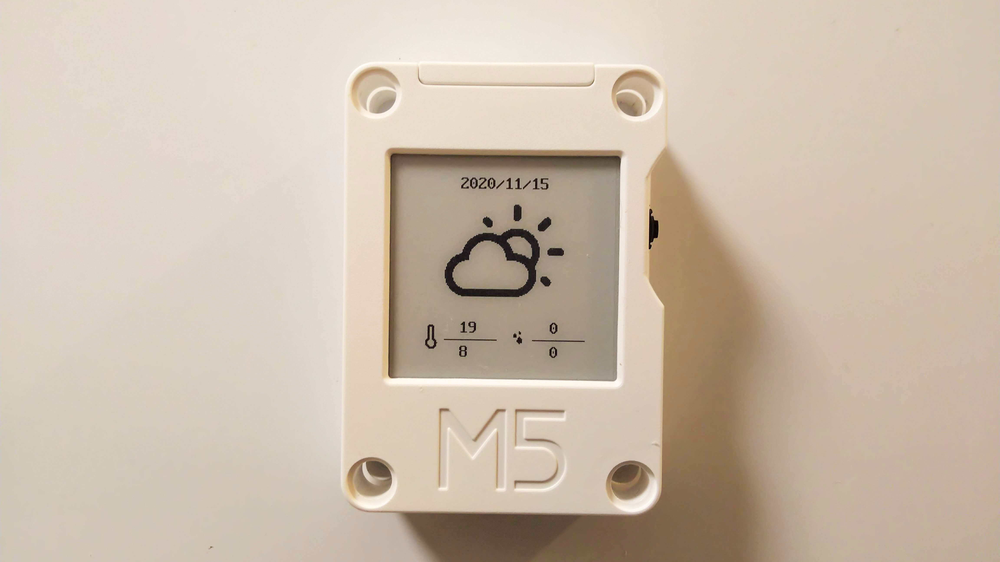

# CoreInk-Weather

M5Stack CoreInkで天気が表示できます。

## Wi-Fi設定

`CoreInk-Weather/secrets.example.h` を `CoreInk-Weather/secrets.h` としてコピーし、SSIDとパスワードを設定してください。`secrets.h` はGitの追跡対象外です。

developブランチでは予定していたほぼ全ての機能が完成していますが、  
[m5stack/M5-CoreInk](https://github.com/m5stack/M5-CoreInk)から最新のCoreInkライブラリを入手する必要があります。  
公式より新バージョンがリリースされ次第 masterブランチへ取り込みます。

## これから開発する機能

* 天気の定期更新 (developブランチにて実装済み)

## 参考

[天気予報をM5Stackで表示してみた \- クラクスの記録帳](https://kuracux.hatenablog.jp/entry/2019/07/13/101143)

## 使用ツール

[coreink-image-converter](https://github.com/wararyo/coreink-image-converter)

## Credits

[Weather Icons](https://erikflowers.github.io/weather-icons/)
